
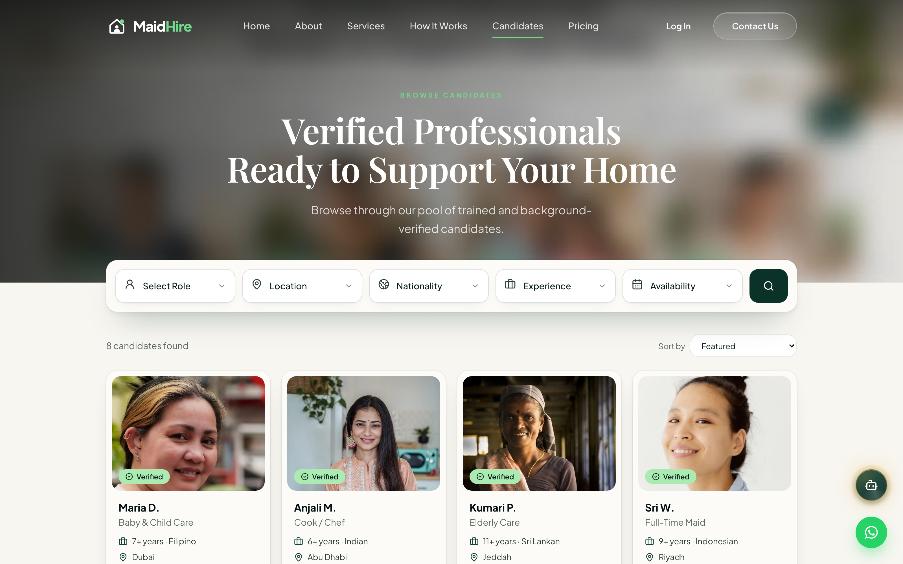
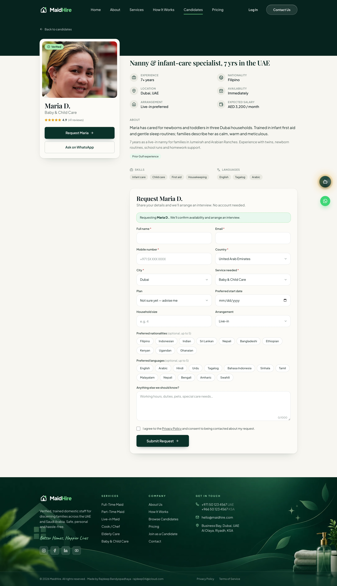
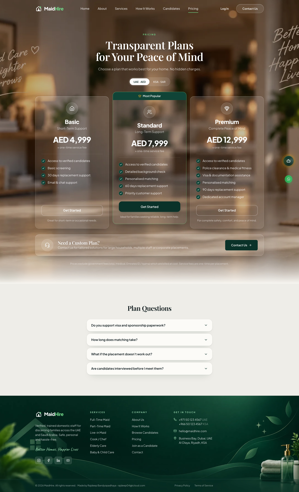
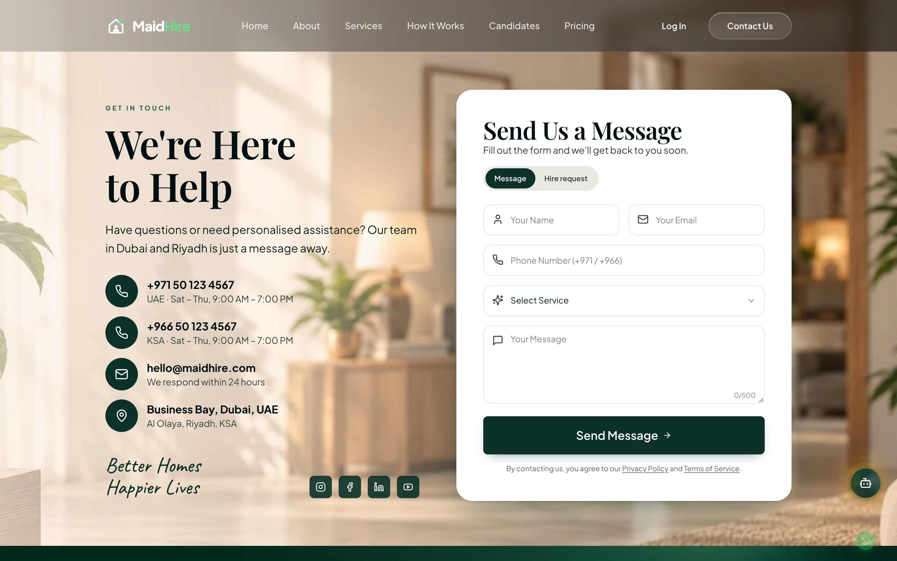
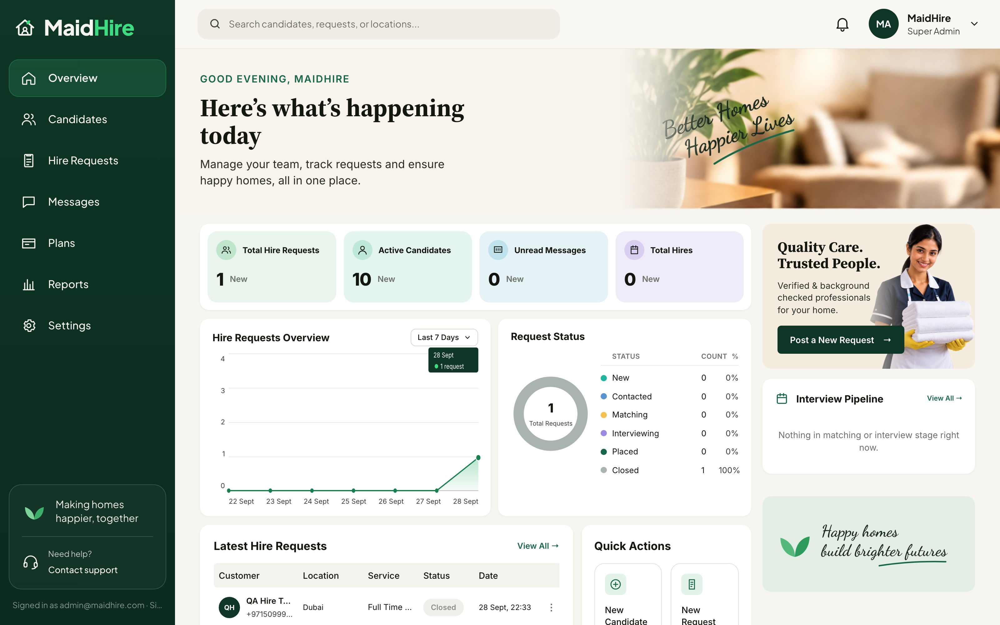
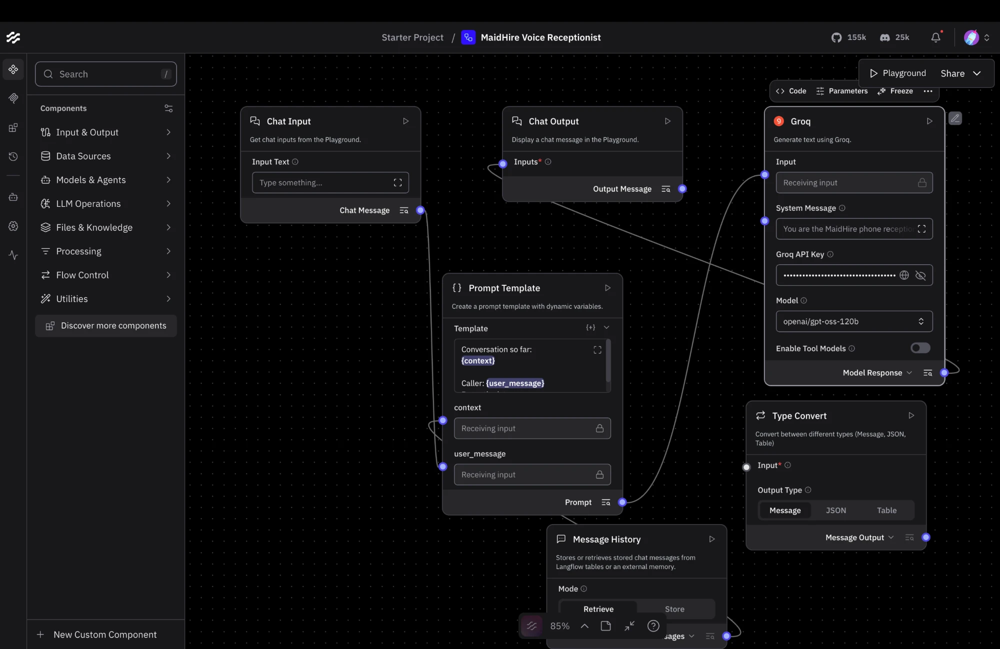
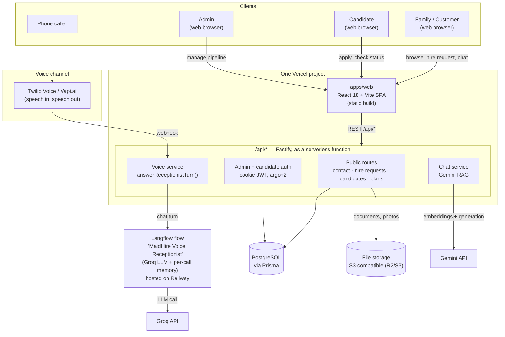

# MaidHire

**A full-stack domestic-staff recruitment platform for the UAE and Saudi Arabia — with an agentic AI layer that talks to customers over the phone, not just in a chat bubble.**

Families need trained, verified household staff (maids, nannies, cooks, caregivers) without the usual friction of agencies: opaque vetting, slow response times, and no way to ask a quick question outside office hours. MaidHire solves this with a self-serve marketplace (browse verified candidates, request a hire, subscribe to a plan) backed by an **admin operations console** for the recruitment team, and — the differentiator — an **AI voice receptionist that answers real phone calls**, grounded in the same knowledge base as the website's chatbot, so a customer gets a consistent, accurate answer whether they type or talk.

## Screenshots

| | |
|---|---|
| **Home** | **Browse Candidates** |
|  |  |
| **Candidate Profile** | **Pricing** |
|  |  |
| **Contact** | **Admin Dashboard** |
|  |  |

**Voice agent build** — the Langflow flow ("MaidHire Voice Receptionist") behind the AI phone receptionist:



## Why this exists

Traditional recruitment agencies lose leads to slow response times and can't staff a receptionist around the clock. MaidHire's answer is a small, coordinated system of AI surfaces instead of one generic chatbot bolted onto a marketing site:

- A **retrieval-grounded web chatbot** that answers pricing/service questions from the site's actual content — not a hallucinated FAQ.
- A **conversational phone agent** that picks up real calls, transcribes speech, reasons over the same knowledge, and speaks a reply back — so "call us" isn't a broken promise outside business hours.
- A **structured admin backend** underneath both, so every hire request, message, and candidate that comes in through any channel (form, phone, or chat) lands in the same pipeline a human ops team already works from.

## Key features

**For families** — browse verified candidates with filters/pagination, view detailed profiles, compare subscription plans (AED/SAR), submit a hire request or message, and get answers instantly via web chat or by calling the AI receptionist.

**For candidates** — apply with photos and documents (auto re-encoded, privately stored), then log in to a status portal to track where their application sits in the pipeline.

**For the recruitment team (admin console)** — a live operations dashboard (hire-request trends, request-status breakdown, candidate pipeline funnel), full candidate management with an audit-logged status pipeline (`Applied → Screening → Interview → Verified → Available → Hired`), hire-request and message queues, and plan management — all behind cookie-JWT auth with CSRF protection.

**Agentic AI layer** — see below.

## The agentic AI layer

Two AI-driven entry points, one shared brain:

| Surface | Model | Grounding | Channel |
|---|---|---|---|
| Website chat widget | Gemini 2.5 Flash + `gemini-embedding-001` | Site content, chunked and embedded, retrieved per query (RAG) | Text, in-browser |
| AI voice/phone receptionist | Groq (via a Langflow flow) | Condensed site knowledge baked into the flow's prompt | Live speech, over a real phone number (Twilio or Vapi) |

The phone channel is the standout piece: an incoming call is answered, transcribed, routed through a Langflow flow ("MaidHire Voice Receptionist") that keeps per-call conversation memory, and the reply is spoken back — a genuine spoken back-and-forth, not a scripted IVR tree. The same Langflow flow also powers a Vapi "Custom LLM" integration, so the receptionist logic is provider-agnostic (Twilio Voice *or* Vapi.ai can front the actual phone number).

## Architecture



## Tech stack

| Layer | Technology |
|---|---|
| Frontend | React 18, Vite 6, TypeScript, Tailwind CSS v4, Framer Motion, TanStack Query, React Hook Form |
| Backend | Fastify 5, TypeScript, Prisma 6, PostgreSQL, argon2 (passwords), jose (JWT), sharp (image processing), Resend (email) |
| Shared | Zod schemas/types shared between client and server (`packages/shared`) |
| AI — chat | Google Gemini (`gemini-2.5-flash` generation, `gemini-embedding-001` retrieval) |
| AI — voice | Langflow (flow orchestration + per-call memory) → Groq (inference), fronted by Twilio Voice or Vapi.ai |
| Infra | Vercel (one project — static frontend + `/api/*` as a serverless function), Postgres (Vercel Postgres/Neon or similar), Railway (Langflow), S3-compatible object storage for uploads |

## Monorepo layout

```
apps/web        React 18 · Vite · TypeScript · Tailwind v4 · Framer Motion · TanStack Query · React Hook Form
apps/api        Fastify 5 · TypeScript · Prisma · PostgreSQL · argon2 · jose (JWT) · sharp · Resend
packages/shared Zod schemas, enums and API types used by BOTH client and server
```

## Quick start

Prerequisites: Node 22+, PostgreSQL 15+.

```bash
npm install
cp apps/api/.env.example apps/api/.env     # edit DATABASE_URL + JWT_SECRET (openssl rand -base64 48)
cp apps/web/.env.example apps/web/.env     # optional in dev (Vite proxies /api → :4000)
createdb maidhire
npm run db:migrate                          # prisma migrate dev
npm run db:seed                             # admin user, plans, testimonials, sample candidates
npm run dev                                 # web on :5173, api on :4000
```

Admin: `http://localhost:5173/admin/login` — credentials come from `ADMIN_EMAIL` / `ADMIN_PASSWORD` in `apps/api/.env` at seed time. **Change them before going live.**

## What's included

**Public site** — Home, About, Services, How It Works, Browse Candidates (filters, pagination, sort), Candidate Profile, Pricing (AED/SAR toggle), Contact (message + hire request), Join as a Candidate (multipart application with photo/documents), Candidate Status portal, Privacy, Terms, 404.

**Backend** — `POST /api/contact`, `POST /api/hire-requests` (customer details stored, no account), `POST /api/candidates/apply` (multipart; photos re-encoded to WebP via sharp, documents stored privately), `GET /api/candidates` (+ `/featured`, `/:slug`), `GET /api/plans`, `GET /api/testimonials`, `POST /api/chat` (Gemini RAG), `POST /api/voice/*` (Twilio webhooks), `POST /api/vapi/chat/completions` (Vapi custom LLM), candidate auth (`/api/candidate/*`).

**Admin** (`/admin`, cookie-JWT, argon2 passwords, CSRF header check) — live overview dashboard (KPIs, request trend chart, status breakdown, candidate pipeline funnel, quick actions), candidate list/detail with pipeline `APPLIED → SCREENING → INTERVIEW → VERIFIED → AVAILABLE → HIRED` and audit log, hire requests with status/notes drawer, contact messages, plan editor.

**Security** — Zod validation on both sides, helmet, CORS allow-list, global + per-route rate limiting, honeypot fields, hashed IPs (never raw), strict file type/size checks, private document storage, non-enumerable candidate slugs, secrets only in env.

## Environment

See `apps/api/.env.example` (all keys documented) and `apps/web/.env.example`.

| Key | Purpose |
|---|---|
| `DATABASE_URL` | PostgreSQL connection string |
| `JWT_SECRET` | ≥32 chars; signs admin sessions |
| `CORS_ORIGINS` | Comma-separated browser origins allowed to call the API |
| `API_PUBLIC_URL` | Public URL of the API (used for local file URLs and Twilio signature verification) |
| `STORAGE_DRIVER` | `local` (dev) or `s3` (Cloudflare R2 / AWS S3) + `S3_*` keys |
| `RESEND_API_KEY`, `EMAIL_FROM`, `NOTIFY_EMAIL` | Enquiry notifications; empty key = log to console |
| `GEMINI_API_KEY` | Powers the web chat widget (RAG over site content) |
| `LANGFLOW_API_URL`, `LANGFLOW_API_KEY`, `LANGFLOW_FLOW_ID` | The Langflow instance/flow behind the voice receptionist |
| `TWILIO_AUTH_TOKEN` | Verifies `/api/voice/*` webhooks really came from Twilio |
| `VAPI_SERVER_SECRET` | Shared secret verifying `/api/vapi/chat/completions` requests really came from Vapi |
| `VITE_API_URL` | (web) API base URL — leave empty when web + API share one Vercel project/domain (same-origin); only set this if the API is hosted on a separate origin |
| `VITE_WHATSAPP_NUMBER` | (web) WhatsApp click-to-chat number, digits only |
| `VITE_VOICE_NUMBER` | (web) AI receptionist phone number shown on the Contact page, digits only |

## Deployment

Web and API deploy as **one Vercel project**, rooted at the repo root:

- `vercel.json` (repo root) builds `packages/shared` then `apps/web` (static output `apps/web/dist`), runs `prisma generate` + `prisma migrate deploy` against `apps/api/prisma/schema.prisma`, and rewrites everything except `/api/*` and `/files/*` to `index.html` (SPA routing).
- `/api/[...path].ts` (repo root) is the serverless entry point: it builds the Fastify app once per warm container (`buildApp()` from `apps/api/src/app.ts`, which never calls `.listen()`) and forwards each request into it via `app.server.emit("request", ...)` — the same routing/plugin pipeline Fastify normally uses, without needing a persistently-open port.
- Because web and API share one domain, auth cookies are same-origin — no CORS or `SameSite=None` juggling needed. `VITE_API_URL` stays empty, same as local dev (Vite's own proxy) and matching `apps/web/src/lib/api.ts`'s default.
- **Storage must be `STORAGE_DRIVER=s3`** (Cloudflare R2 or similar) — Vercel functions have no persistent disk, so `STORAGE_DRIVER=local` will silently lose every upload. Set `S3_BUCKET`, `S3_ACCESS_KEY_ID`, `S3_SECRET_ACCESS_KEY`, `S3_ENDPOINT`, `S3_PUBLIC_URL`.
- **Database** → any Postgres reachable from Vercel's build + runtime (Vercel Postgres/Neon, Supabase, etc.) — set `DATABASE_URL` as a project env var (available at both build time, for the migration step, and runtime).
- Set `COOKIE_SECURE=true`, `CORS_ORIGINS=https://<your-vercel-domain>`, `JWT_SECRET` (fresh, ≥32 chars), plus the AI keys below.
- **Voice AI** → Langflow doesn't fit a serverless platform (it's a persistent Python service with its own DB) — it runs as its own always-on service (e.g. Railway's official Langflow template), pointed at its own Postgres via `LANGFLOW_DATABASE_URL` for persistence. Set `LANGFLOW_API_URL`/`LANGFLOW_API_KEY`/`LANGFLOW_FLOW_ID` on the Vercel project to point at it. The phone number's webhook (Twilio "A call comes in", or Vapi's assistant → Custom LLM) points at the deployed API's `/api/voice/incoming` or `/api/vapi/chat/completions`.

Rate limiting note: `@fastify/rate-limit`'s default store is in-memory, which doesn't persist across serverless invocations/cold starts — limits become best-effort rather than strict on this hosting model. Not a concern on a persistent host (Render/Docker, still supported via `apps/api/Dockerfile` if preferred over Vercel for the API).

## Scripts

`npm run dev` · `npm run build` · `npm run typecheck` · `npm run db:migrate` · `npm run db:seed` · `npm run db:studio -w apps/api`

## Replacing imagery

All marketing images live in `apps/web/public/images` (hero poster, section headers, `services/*.webp`); the ambient hero loop lives in `apps/web/public/video` (`hero.webm` + `hero.mp4`, muted, ~9 s, ≤1.3 MB — re-encode replacements with `ffmpeg -an -movflags +faststart`). Seed candidate photos live in `apps/api/prisma/seed-assets`. Swap the files, keep the names.

## AI voice receptionist (Twilio or Vapi → Langflow → Groq)

When someone dials the MaidHire number, the call is answered, the caller's speech is transcribed, and it's posted to the API. The API calls a Langflow flow ("MaidHire Voice Receptionist": Chat Input → Memory → Prompt → Groq → Chat Output), which replies grounded in a condensed summary of the site content, and the telephony provider speaks the reply back — a live, spoken back-and-forth, separate from the text chat widget (which runs on Gemini, untouched).

**Requires Langflow running** (self-hosted, or the desktop app for local dev) — the API calls out to it on every turn, so calls will fail if it's not reachable.

**Option A — Vapi.ai:**
1. In Langflow, open the flow and get an API key (Settings → Langflow API Keys → Add New).
2. Set in `apps/api/.env`: `LANGFLOW_API_URL`, `LANGFLOW_API_KEY`, `LANGFLOW_FLOW_ID`.
3. In your Vapi assistant → Model → **Custom LLM**, set the URL to `https://<your-public-api-url>/api/vapi/chat/completions` and an `Authorization: Bearer <secret>` header.
4. Set `VAPI_SERVER_SECRET` in `apps/api/.env` to that same secret.

**Option B — Twilio Voice:**
1. Steps 1–2 above.
2. Buy a Twilio number with Voice capability.
3. In the Twilio Console → your number → **Voice Configuration**, set "A call comes in" to **Webhook**, `POST`, pointing at `https://<your-public-api-url>/api/voice/incoming`. Optionally set the status callback to `.../api/voice/status`.
4. Set `TWILIO_AUTH_TOKEN` in `apps/api/.env` — verifies webhooks really came from Twilio. Required before going live.
5. For local dev, tunnel the API (e.g. `ngrok http 4000`) and point the Twilio webhook at the tunnel URL — also update `API_PUBLIC_URL` to match, since it's used to verify the Twilio signature.

Either way, set `VITE_VOICE_NUMBER` in `apps/web/.env` (digits only) to show a click-to-call entry on the Contact page. Hidden automatically until this is set.

Routes live in `apps/api/src/routes/voice.ts` (Twilio) and `apps/api/src/routes/vapi.ts` (Vapi); the shared call into Langflow is in `apps/api/src/services/voice.ts`. Conversation history is kept by Langflow itself (its Memory component, keyed by the call's session id) — the API doesn't track it.

**Don't edit the flow in Langflow's canvas** — opening it has previously auto-saved a broken cleanup of the node connections. If you need to change the flow, edit it via Langflow's API instead.

## Roadmap hooks (architected, not built)

Employer accounts & favourites · online payments (Razorpay/Stripe/Tap) · WhatsApp Business API notifications · Arabic/RTL locale (design tokens use logical props; `dir` attribute is on `<html>`) · blog CMS · signed-URL document viewer.
